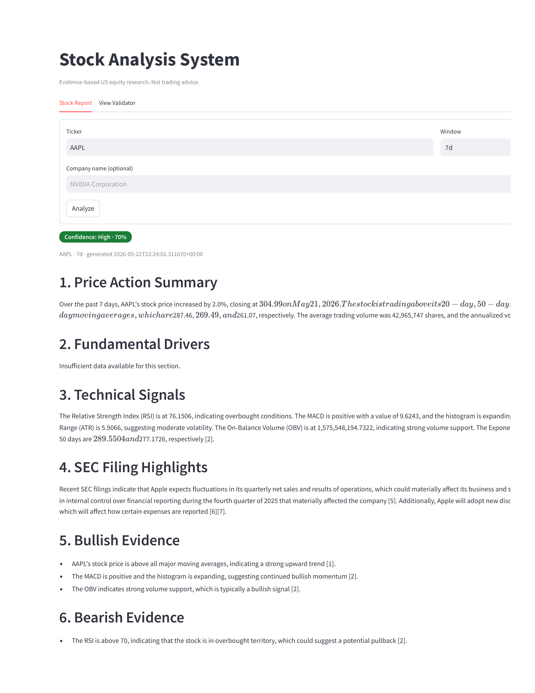
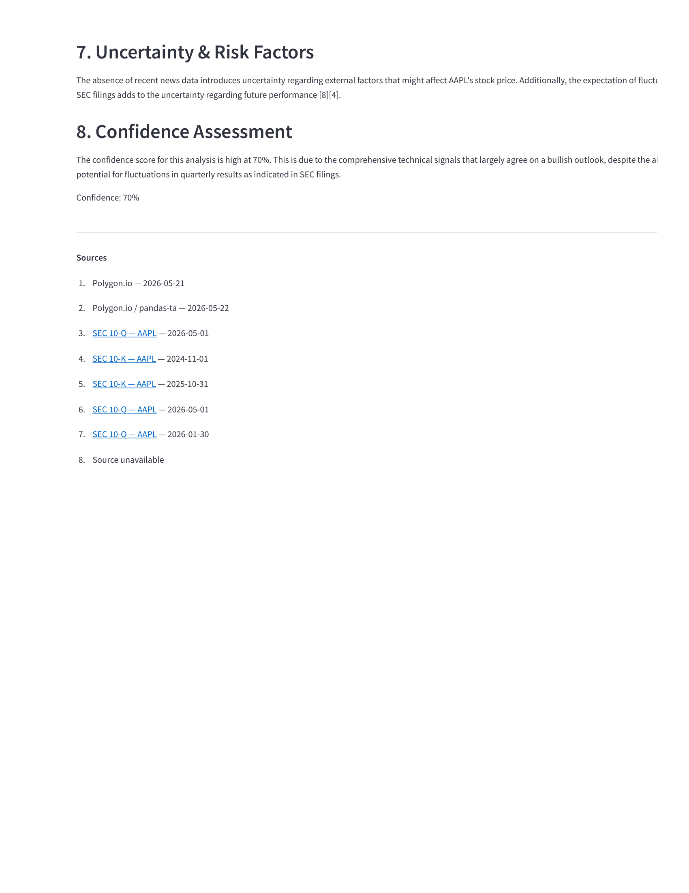

# Citation-aware research assistant

A citation-aware US equity research assistant. It synthesizes market data, technical
indicators, financial news, and SEC filings into structured research reports where **every
factual claim is tagged to a source**.

> This is a research tool, **not** a trading bot or prediction engine. It does not give
> buy/sell recommendations. It presents evidence and uncertainty so you can form your own view.

## Screenshots

Stock report with inline citations and the deterministic confidence badge (the report is long,
so it is shown in two parts):





<!-- Optional: add a View Validator screenshot, e.g.  -->

## Features

- **Citation-tagged reports** — the LLM tags each claim with `[cite:N]`; the UI resolves these
  to numbered footnotes with clickable source links.
- **8-section research report** — Price Action, Fundamental Drivers, Technical Signals, SEC
  Filing Highlights, Bullish Evidence, Bearish Evidence, Uncertainty & Risk, Confidence
  Assessment.
- **Deterministic confidence score** — a 0–100 score computed from measurable signals (not the
  LLM grading itself), mapped to tiers (High / Moderate / Low / Very Low). Reports below 33% are
  blocked as insufficiently supported.
- **Thesis back-testing** — submit a free-text thesis and get a directional verdict plus return,
  drawdown, Sharpe, and a benchmark comparison vs SPY.
- **SEC filing RAG** — semantic search over EDGAR filings via a local ChromaDB vector store.
- **Graceful degradation** — if a data source is unavailable, the affected section is marked
  unavailable rather than fabricated.

## Architecture

```
                 ┌──────────────┐         HTTP          ┌────────────────────┐
                 │  Streamlit   │ ───────────────────▶  │   FastAPI backend  │
                 │  frontend    │ ◀───────────────────  │  /analyze /validate│
                 └──────────────┘                       └─────────┬──────────┘
                                                                   │
                            ┌──────────────────────────────────────┼───────────────────────┐
                            ▼                     ▼                 ▼                        ▼
                      market-data           tech-indicator       web-access            finance-rag
                      (Polygon.io)          (pandas-ta)          (NewsAPI)             (ChromaDB + SEC)
                            └──────────────── stock-retro (concurrent orchestration) ──────────────┘
                                                       │
                                          GPT-4o synthesis + citations
                                                       │
                                   confidence-gate  +  view-validator
```

- **Atomic skills** return a uniform envelope `{ status, data, citations, error, source }`.
- **stock-retro** runs the data skills concurrently, assembles a citation-indexed context
  bundle, computes the confidence score, then calls GPT-4o for synthesis.
- **confidence-gate** maps the score to a tier and blocks low-confidence reports.
- **view-validator** extracts the thesis direction and backtests it against historical prices.

## Tech stack

| Layer | Choice |
|---|---|
| LLM | OpenAI GPT-4o (synthesis), GPT-4o-mini (thesis direction) |
| Market data | Polygon.io |
| News | NewsAPI |
| Indicators | pandas-ta (RSI, MACD, Bollinger Bands, ATR, OBV, EMA, moving averages) |
| Trading calendar | pandas-market-calendars |
| Vector DB / embeddings | ChromaDB + sentence-transformers (`all-MiniLM-L6-v2`) |
| Backend | FastAPI + Uvicorn |
| Frontend | Streamlit |

## Project structure

```
backend/
├──  main.py                 FastAPI app + routers + error handler
├──  routers/                /analyze, /validate-view
├──  skills/                 market_data, web_access, tech_indicator,
                             stock_retro, finance_rag, confidence_gate,
                             confidence_score, view_validator
├──  models/                 Pydantic models (citation, report)
├──  prompts/                synthesis + citation rules
├──  utils/                  citation_parser, sec_fetcher, vector_store, dates
frontend/
├──  app.py                  Streamlit app (Stock Report + View Validator tabs)
├──  components/             report_view, confidence_badge, validator_panel
requirements.txt
smoke_test.py
```

## Setup

Requires Python 3.12+.

```bash
# 1. Install dependencies
pip install -r requirements.txt

# 2. Configure API keys
cp .env.example .env
# then edit .env and fill in your keys
```

Required environment variables (`.env`):

| Variable | Service | Used by |
|---|---|---|
| `OPENAI_API_KEY` | OpenAI | report synthesis, thesis direction |
| `POLYGON_API_KEY` | Polygon.io | market data, price backtests |
| `NEWS_API_KEY` | NewsAPI | news evidence (degrades gracefully if missing) |

## Running

The app runs as two processes. Start the backend first, then the frontend.

```bash
# Terminal 1 — backend (run from the project root)
uvicorn backend.main:app --port 8000

# Terminal 2 — frontend
streamlit run frontend/app.py
```

Open the Streamlit URL (default http://localhost:8501). The frontend calls the backend at
`http://localhost:8000` by default; override with the `BACKEND_URL` environment variable.

### Stopping the app

Each process runs until you stop it:

- **Running in the terminal:** press `Ctrl+C` in each terminal.
- **Running detached / in the background:** stop it by port:

```bash
lsof -ti :8000 | xargs kill   # backend
lsof -ti :8501 | xargs kill   # frontend
```

## API

| Method | Endpoint | Body | Returns |
|---|---|---|---|
| POST | `/analyze` | `{ ticker, window: "7d"\|"30d"\|"90d", company_name? }` | report, evidence, citations, confidence |
| POST | `/validate-view` | `{ thesis, ticker, timeframe }` | verdict + metrics (return, drawdown, Sharpe, vs SPY) |
| GET | `/health` | — | `{ status: "ok" }` |

## How the confidence score works

The score (0–100) is computed in code from three components, so it actually varies with the
evidence instead of being a self-reported guess:

- **Data completeness (40)** — how many sources (price, technical, SEC, news) are available.
- **Signal coherence (35)** — how decisively the price/technical signals (return, moving
  averages, MACD, RSI, EMA crossover) agree on a single direction.
- **Evidence depth (25)** — volume of SEC chunks and news articles retrieved.

The breakdown is shown in the UI under "How this score was computed."

## Testing

```bash
pytest
```

## Notes

- **First analysis of a new ticker is slow.** It downloads that ticker's SEC filings from EDGAR,
  chunks and embeds them into ChromaDB, and (once) downloads the embedding model. Subsequent
  analyses of the same ticker are fast.
- **NewsAPI free tier** has a limited daily quota; when it's exhausted the news section degrades
  and the report is built from the remaining sources.
